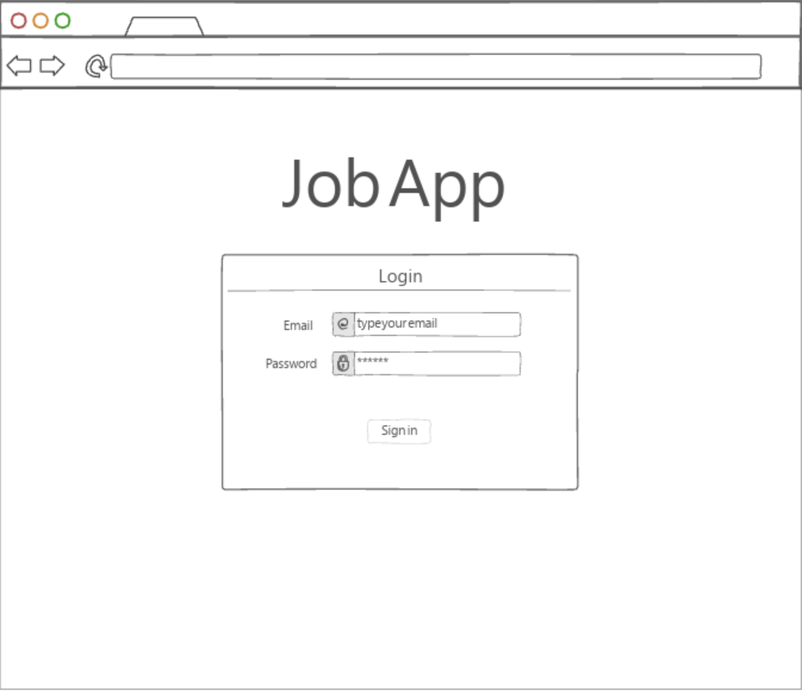
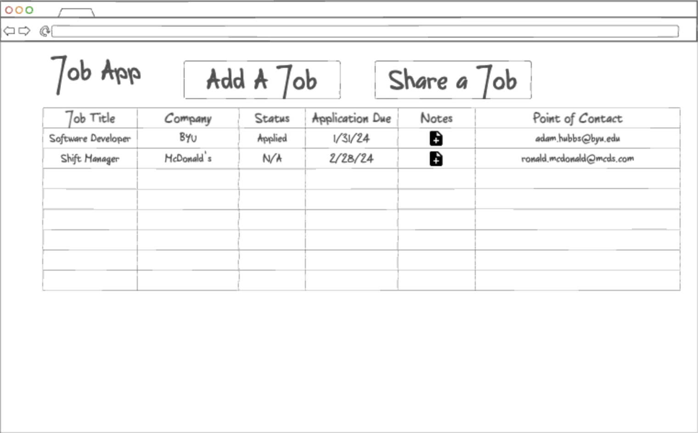
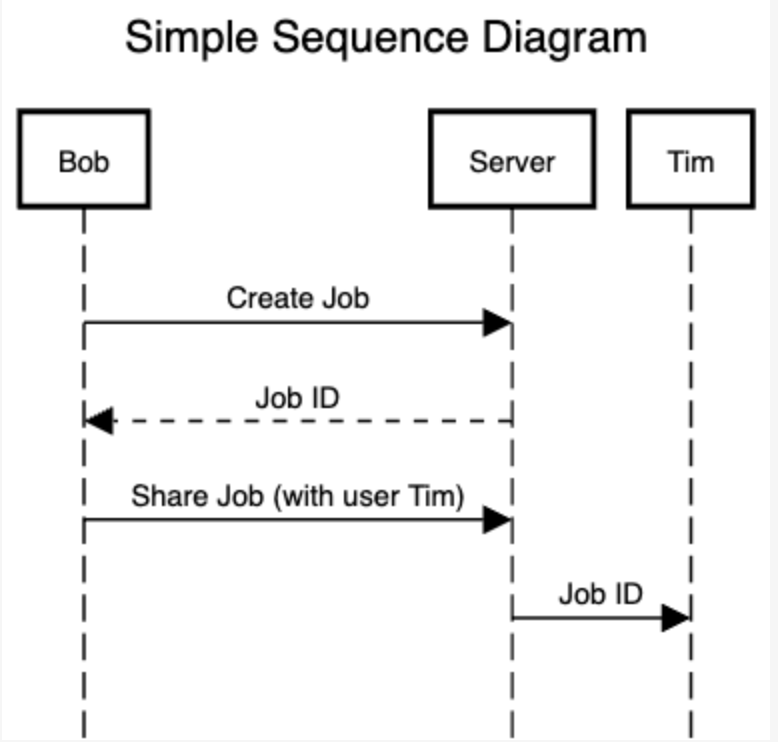

# Job App

Here is a link to my [class notes](./notes.md).

## Specification Deliverable

### Elevator Pitch

Most of us have experienced the confusion of applying for jobs. In today's world, most job applications are submitted online - apply to several jobs and you may begin to find it difficult to keep track of where you've applied. This app is here to help you record critical information about jobs you've applied to. In Job App, you can track job titles, points of contact, job descriptions, application statuses, and more. You can also share jobs you've found with friends and other users who may want to apply. Job App is here to streamline your job finding process.

### Design

Here's a simple login page.

Here's a simple mockup of the home page where users can add jobs.

Here's a simple sequence diagram of how users will interact with the server.

### Key Features

- Login over HTTPS
- Ability to create, update, and delete job applications
- Ability to share jobs with other users and display them in their view
- Notifications when a job is shared with you
- Jobs persistently stored in database
- Sort and filter your job view

### Technologies

- **HTML** - Usage of HTML for website structure. Two HTML pages for login and homepage
- **CSS** - Usage of CSS to style application text, color, interaction with buttons, etc
- **JavaScript** - Make the application interactive by allowing users to create, edit, share, and delete jobs. Also add capabilities such as filtering job applications by fields.
- **Web Service** - Backend server with endpoints for:
    - creating a job
    - updating a job
    - sharing a job
    - deleting a job
- **Database** - Database stores fields of created jobs persistently
- **Authentication** - User credentials stored in database. Users cannot login with incorrect or nonexistent credentials
- **WebSocket** - Server sends real-time notifications of when jobs are shared with them
- **React** - Application ported using React framework. May breakdown project into components

## HTML Deliverable

I built out the basic structure of JobApp in HTML. Here is a list of things that I did:

- Built out page structure for login and main page using headers, main sections, footers, and asides
- Inluded an image in the header of each page
- Added placeholder login fields using a form
- Added placeholder database information with a table on the jobs page
- Added a placedholder aside field to display a notification (will be implementing live notifications with WebSocket)
- The sign in button links to the jobs page, and the sign out button links back to the login page
- `add.html`, `share.html`, and `delete.html` are placeholders for interactive elements that will be displayed when users want to perform these actions. The buttons for subimitting these actions on the respective pages all link back to `jobs.html`
- Updated my [HTML notes](./notes/html-deliverable.md) with things I learned in the process
- In `add.html`, there is a placehoder for the user to indicate if they'd like to add a reminder to apply for the job they're adding to Google Calendar. This will use the Google Calendar API to create an event in their calendar in advance of the application deadline as a reminder to apply

**Note** - I updated my link so that the doman name [jobapp.click](https://jobapp.click) routes to my main page while [startup.jobapp.click](https://startup.jobapp.click) routes to the default page we were provided with. 

## CSS Deliverable

I added CSS styling in the following ways corresponding to the rubric:
- Header, footer, and main content body - styled each element to fit desktop and mobile screens the way I like with black color in the header and footer
- Navigation elements - styled buttons (add, share, delete, sign out)
- Responsive to window resizing - Used a media query to adjust the layout of the home page from table to card view. Card view looks much better on mobile.
- Application elements - used Bootstrap to style main table and added popovers and modals to help condense table data and allow users to click into icons for more information.
- Application text content - Used the Google font "Inter" and applied that style to all text in my app.
- Application images - Used Bootstrap SVG icons and sized them with CSS properties.

## JavaScript Deliverable

I implemented interactivity in the app in the following ways corresponding to the rubric:
- Javascript support for future login - when a user inputs a username, that username is stored in localStorage and displayed when the user icon in the top right of `jobs.html` is clicked on. If no username is specified, "Mystery User" is displayed
- JavaScript support for future database data - I added functionality to add, edit, and delete tracked jobs from the database, which is currently stored in localStorage. Buttons to edit and delete appear when the corresponding job title is clicked on
- JavaScript support for future WebSocket - I used a setInterval function on the main page to "notify" the user every 10 seconds of a job that has been shared with them. This can be seen when you enter the notification modal by clicking on the bell icon in the top right of the main page. Added JavaScript functionality to add the job or ignore it
- JavaScript support for application logic - not a ton of logic is used in my app, however, the notification icon changes based on the number of shared job notifications, and logic was needed to edit/delete stored jobs based on job ID

## Service Deliverable

I implemented service endpoints in the following ways corresponding to the rubric:
- Create an HTTP service using Node.js and Express - utilizing Node.js and Express for a backend server
- Frontend served up using Express static middleware - done
- Your frontend calls third party service endpoints - I get a random quote from an API I found [here](https://forum.freecodecamp.org/t/free-api-inspirational-quotes-json-with-code-examples/311373) and display that quote on `index.html`. You can see it by adding a job, clicking on the job title on the main screen, then going to the share page.
- Your backend provides service endpoints - my backend provides endpoints for adding, deleting, and editing jobs. Adding is more obvious, and you can delete or edit a job by clicking on the job title and selecting either button. Endpoints are also called to edit jobs when the job status or notes are changed on the main page.
- Your frontend calls your service endpoints - done. Front end calls endpoints for all interactivity with jobs.

## Login Deliverable
I added database and login functionality in the following ways corresponding to the rubric:
- Supports new user registration - new users are added to the database when using the `Register` option on `index.html`
- Supports existing user authentication - existing users' passwords are checked, and an error appears if they give incorrect login credentials.
- Stores application data in MongoDB - job information are stored in MongoDB
- Stores and retrieves credentials in MongoDB - user information also stored in MongoDB
- Restricts application functionality based upon authentication - employed secureApiRouter as used in the Simon example to make sure all requests after login are authenticated. I want to make this cleaner in the future and have error messages pop up on the frontend when a user tries to make an unauthorized request, but it does work, i.e., unauthorized requests are not carried out by the server and the server sends a 401 error. 

## Websocket Deliverable
Did the following to implement Websockets:
- Backend listens for WebSocket connection - done.
- Frontend makes WebSocket connection - done, frontent makes ws connection in `jobs.js`.
- Data sent over WebSocket connection - done, when jobs are shared with another existing user, if that user is online and they are on the `jobs.html` page, they will get that shared job added to their notifications list and have the option to add it to their tracked jobs. If the user is not online or is not on `jobs.html`, the server will instead add that job to a shared collection in the database, and the user the job was shared with will have all shared jobs since they were gone loaded upon logging in. The key to know if you have shared jobs to either add or ignore is the notification icon will either have a slash through it or not.
- WebSocket data displayed in the application interface - done, shared jobs are populated into the notification list.

## React Deliverable
Did the following:
- Bundled using Vite - done
- Multiple functional react components - done
- React router - done
- React hooks - done
